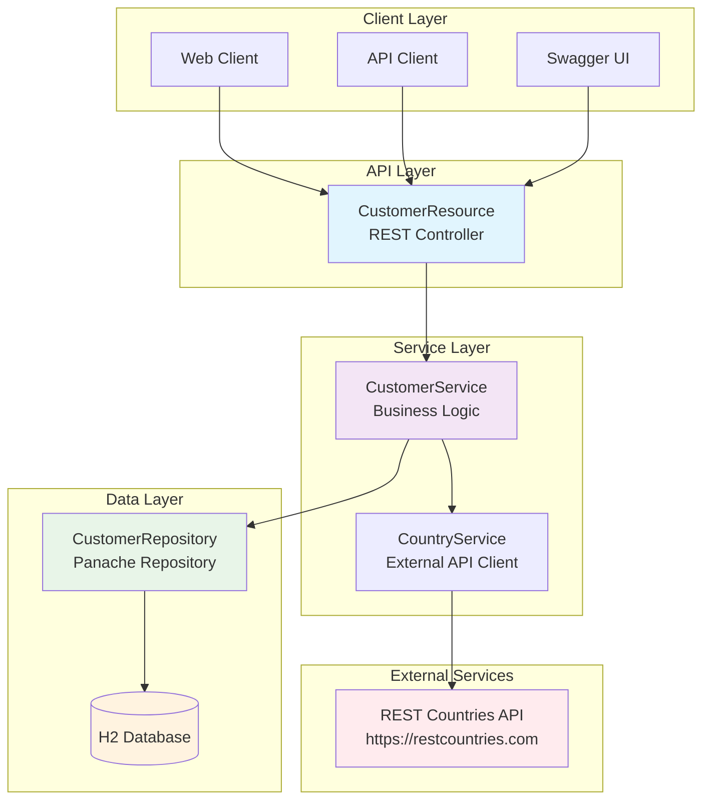

# Customer Management Service - Architecture Diagram

## System Architecture

## Component Details

### 1. API Layer (Resource)
- **CustomerResource**: REST controller handling HTTP requests
- **DTOs**: CreateCustomerRequest, UpdateCustomerRequest for data transfer
- **Validation**: Bean validation annotations for input validation
- **Error Handling**: Global exception mapping for consistent error responses

### 2. Service Layer
- **CustomerService**: Core business logic implementation
- **CountryService**: External API client for country information
- **Transaction Management**: CDI @Transactional for data consistency

### 3. Data Layer
- **CustomerRepository**: Panache repository for database operations
- **Customer Entity**: JPA entity with proper mappings and validation
- **H2 Database**: In-memory database for development and testing

### 4. External Integration
- **REST Countries API**: External service for country demonym lookup
- **Rest Client**: MicroProfile Rest Client for external API calls

## Technology Stack

- **Framework**: Quarkus 3.8.1
- **Language**: Java 17
- **Database**: H2 (In-memory)
- **ORM**: Hibernate ORM with Panache
- **API Documentation**: SmallRye OpenAPI + Swagger UI
- **Testing**: JUnit 5 + Mockito + REST Assured
- **Build Tool**: Maven

## Data Flow

1. **Create Customer**:
   - Client sends POST request with customer data
   - API validates input and creates Customer entity
   - Service validates email uniqueness
   - Service fetches country demonym from external API
   - Repository persists customer to database
   - Response returns created customer with ID

2. **Get Customers**:
   - Client sends GET request
   - Service retrieves customers from repository
   - Repository queries database and returns list
   - Response returns customer data

3. **Update Customer**:
   - Client sends PUT request with updates
   - Service validates customer exists
   - Only allowed fields (email, address, phone, country) are updated
   - If country changed, new demonym is fetched
   - Repository updates customer in database

4. **Delete Customer**:
   - Client sends DELETE request with customer ID
   - Service validates customer exists
   - Repository removes customer from database

## Security Considerations

- Input validation using Bean Validation annotations
- SQL injection prevention through JPA/Hibernate
- External API calls with proper error handling
- Email uniqueness validation to prevent duplicates

## Performance Considerations

- In-memory H2 database for fast development
- Connection pooling via Agroal
- Lazy loading for JPA relationships
- Efficient queries using Panache repository methods
